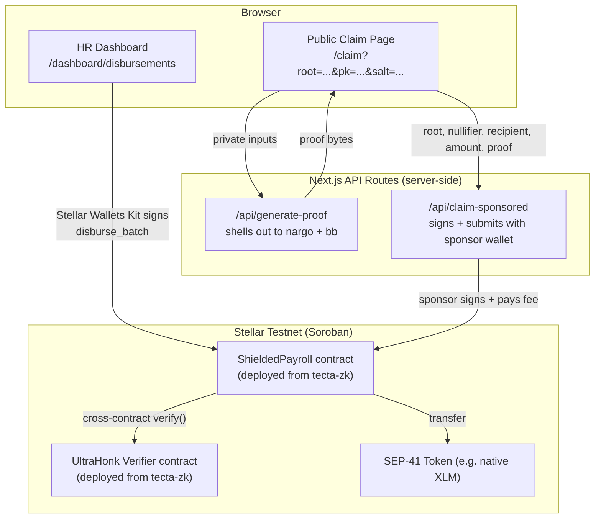

# Tecta — Frontend

Next.js frontend for **Tecta**, a confidential ZK payroll settlement layer on Stellar/Soroban. This app is the HR dashboard and the public employee claim page — it does **not** implement the ZK circuit or the smart contracts themselves. Those live in a separate repo: **[azzaky9/tecta-zk](https://github.com/azzaky9/tecta-zk)**.

If you haven't deployed the contracts yet, do that first — see [tecta-zk's `USAGE.md`](https://github.com/azzaky9/tecta-zk/blob/master/USAGE.md) for the full step-by-step (identities, funding, build, deploy, initialize). Everything below assumes you already have a deployed, initialized `PAYROLL` contract and a deployed `VERIFIER` contract.

---

## Architecture (end-to-end)



- **HR Dashboard** — connects a wallet via Stellar Wallets Kit, builds a payroll batch, computes Poseidon commitments + a Merkle root client-side, and signs `disburse_batch` directly.
- **Public Claim Page** — no dashboard chrome, no login. Everything an employee needs is embedded in the URL's query params. Proof generation happens through a server API route; submission happens through a sponsor wallet so the employee never needs XLM or to sign anything.

---

## Tech Stack

- **Next.js 16** (App Router) + TypeScript
- **`@stellar/stellar-sdk`** — transaction building, RPC calls, all on-chain reads/writes
- **`@creit.tech/stellar-wallets-kit`** — wallet connect/sign for HR and (optionally) employees
- **`poseidon-lite`** — client-side Poseidon hashing, matching the Noir circuit's parameters exactly
- **`driver.js`** — first-visit guided tour on the Disbursements page
- **`@web3icons/react`** — token/network icons resolved dynamically from the contract's actual token
- **Tailwind CSS v4** (CSS-first config, no `tailwind.config.js`) + `motion` (Framer Motion) for animation
- **Bun** as the package manager/runtime (`bun install`, `bun run dev`)

---

## Environment Setup

Two files, both gitignored:

**`.env`** (or `.env.local`) — contract IDs and network config, safe to be public-facing (`NEXT_PUBLIC_` prefix exposes these to the browser, which is fine — contract IDs aren't secrets):

```
NEXT_PUBLIC_STELLAR_NETWORK=testnet
NEXT_PUBLIC_STELLAR_PAYROLL_ID=<PAYROLL_ID from tecta-zk deployment>
NEXT_PUBLIC_STELLAR_VERIFIER_ID=<VERIFIER_ID from tecta-zk deployment>
STELLAR_NETWORK=testnet
STELLAR_PAYROLL_ID=<same PAYROLL_ID, server-side copy>
STELLAR_VERIFIER_ID=<same VERIFIER_ID, server-side copy>
```

**`.env.local`** — server-only secret, **never** prefix this with `NEXT_PUBLIC_`:

```
PAYROLL_SPONSOR_SECRET=<a dedicated Stellar secret key, separate from your HR/admin key>
```

This is the wallet that pays gas for gasless employee claims (see below). Keep it separate from the HR admin key — one key leaking shouldn't drain both the payroll treasury and the gas sponsor.

---

## Getting Testnet XLM

You need funded wallets for two roles:

1. **HR / admin wallet** — whatever you initialized the payroll contract with in `tecta-zk`. Fund via:
   ```bash
   curl "https://friendbot.stellar.org/?addr=<HR_PUBLIC_KEY>"
   ```
   Or connect that wallet in the dashboard and use Freighter/xBull's own testnet funding if supported.

2. **Sponsor wallet** (for `PAYROLL_SPONSOR_SECRET`) — generate and fund a fresh keypair dedicated to paying employee claim fees:
   ```bash
   node -e "const {Keypair}=require('@stellar/stellar-sdk'); const k=Keypair.random(); console.log('PUB:',k.publicKey()); console.log('SEC:',k.secret());"
   curl "https://friendbot.stellar.org/?addr=<SPONSOR_PUBLIC_KEY>"
   ```
   Put the secret in `.env.local` as `PAYROLL_SPONSOR_SECRET`.

Employees generally **don't** need testnet XLM at all — that's the point of the gasless claim path (see below).

---

## Running the Project

```bash
bun install
bun run dev
```

Open `http://localhost:3000`.

---

## Using the App, Start to Finish

### 1. HR disburses a batch

Go to `/dashboard/disbursements` (first visit triggers an automatic `driver.js` walkthrough). Add employees with a name and amount — amounts are always entered in human-readable units; the app resolves the token's `decimals()` on-chain and scales to raw units automatically. Click **Initialize Disburse**.

**Signature/auth here:** the connected HR wallet must sign this transaction. The contract's `disburse_batch(hr, total_amount, new_root)` calls `hr.require_auth()` and checks `hr` matches the stored admin — so only the wallet that initialized the contract can disburse. Funds move from that wallet into the payroll contract's treasury in the same transaction.

After a successful disburse, a modal shows each employee's private claim secrets (private key, salt, commitment) — copy these out to build claim links (see Step 3).

### 2. Understanding the signature model

This is the part that makes gasless claims possible, so it's worth being explicit:

- **`disburse_batch`** *does* require a signature — `hr.require_auth()` — because only HR is allowed to move treasury funds and extend the root history.
- **`claim`** *never* calls `recipient.require_auth()`. The only gates are: the Merkle root must be in history, the nullifier must be unspent, and the ZK proof must verify. Since the recipient's signature isn't part of the authorization model at all, **who submits and pays for the claim transaction is irrelevant to who receives the funds.**

That's what `/api/claim-sponsored` exploits: a dedicated sponsor wallet is the transaction source and signer, with the employee's address passed as a plain function argument.

### 3. Building a claim link

A claim link is just the public `/claim` page with everything the circuit needs in the query string:

```
/claim?root=<merkle_root>&amount=<human_amount>&pk=<secret_key>&salt=<salt>&idx=<tree_index>&path=<comma_separated_sibling_path>&name=<optional_display_name>
```

`root`, `path`, and `idx` come from the Merkle tree computed at disburse time (the secrets modal after disbursing has everything except the sibling path — computing that requires the full batch's commitment list; see `lib/payroll-sdk.ts`'s `getSiblingPath`, or reuse one of the `scripts/*.mts` regression scripts as a template). Send this link to the employee however you like — email, Slack, an invoicing tool. Nothing sensitive is stored server-side; the link itself *is* the credential.

### 4. Employee claims (gasless)

The employee opens the link, optionally connects a wallet or generates a fresh BN254-compatible one in-browser (most random Stellar keypairs don't satisfy the circuit's field constraint — see `getRecipientFieldElement` in `lib/payroll-sdk.ts` — so there's a one-click generator that loops until it finds a compatible one), and clicks **Claim Salary**. A stepper modal shows: proof generation (real ZK proving via `/api/generate-proof`, takes several seconds) → submission (via `/api/claim-sponsored`) → done, with a clickable stellar.expert transaction link.

No wallet signature, no gas fee, no prior XLM balance required on the employee's end.

---

## Integrating with the Deployed Smart Contracts

This is the part specific to this repo — everything above assumes contracts already exist. Wiring a frontend instance to a `tecta-zk` deployment:

1. **Deploy contracts** following [tecta-zk's `USAGE.md`](https://github.com/azzaky9/tecta-zk/blob/master/USAGE.md) end to end (build → deploy verifier → deploy payroll → initialize).
2. **Set env vars** (`NEXT_PUBLIC_STELLAR_PAYROLL_ID`, `NEXT_PUBLIC_STELLAR_VERIFIER_ID`) to the deployed contract IDs.
3. **`lib/payroll-sdk.ts`** is the integration layer — it's the single place that knows the contract's function signatures, argument encoding (ScVal construction for `Bytes`/`i128`/`Address`), and read patterns (`get_roots`, token `balance`/`decimals`/`symbol` via simulated calls). If the contract's interface changes, this file is what needs updating.
4. **`app/api/generate-proof/route.ts`** shells out to `nargo execute` and `bb prove` using the **exact same circuit and toolchain version** the deployed verifier was built against. Toolchain mismatch is the single most common failure mode (`Error(Contract, #3)` on claims) — see `tecta-zk`'s `resolve.md` for the full postmortem. The toolchain paths are currently hardcoded to `/home/azxky9/hackathon/tecta-wasm/circuits` and `~/.bb/bb`; update these if your `tecta-zk` checkout lives elsewhere.
5. **`app/api/claim-sponsored/route.ts`** is the only place `PAYROLL_SPONSOR_SECRET` is read — it never reaches the client bundle.

---

## Scripts (`scripts/`)

Regression/debugging tools that exercise the full on-chain flow directly (bypassing the UI). All require `HR_SECRET` as an environment variable — never hardcode it:

- `e2e_full_flow.mts` / `e2e_human_amounts.mts` — disburse → prove → claim, end to end
- `e2e_sponsored_claim.mts` / `e2e_public_claim_link.mts` — the gasless claim path specifically, including a genuinely fresh (never-funded) recipient wallet
- `make_example_claim_link.mts` — disburses one entry and prints a ready-to-use claim link
- `generate-compatible-key.js` — finds a BN254-field-compatible Stellar keypair (same logic as the in-app "generate wallet" button)

```bash
HR_SECRET=<your funded HR secret key> npx tsx scripts/e2e_full_flow.mts
```
